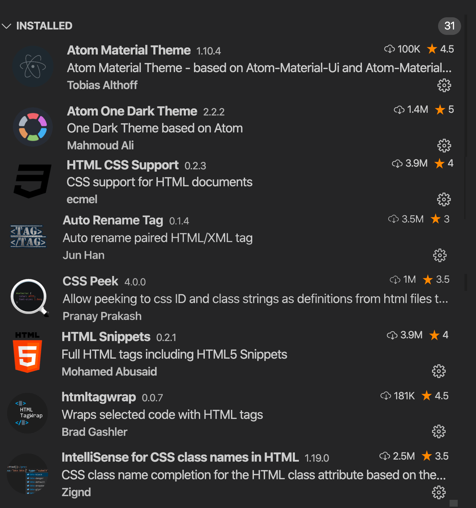

#  VSCode Extensions For HTML CSS Workflows  
All you need to start developing JavaScript is a code editor, a browser and a great idea. I often say that choosing a code editor is a very flippant decision for most developers. If you become bitten by the JavaScript bug you will probably spend more time with your code editor than your friends and family. So you better choose wisely. Your editor should be a comfortable space that allows you to perform tasks effectively and efficiently.	

I will be using Visual Studio Code VSCode and you can download it [here](https://code.visualstudio.com/) for you operating system.

## ***Helpful Plugins***
I am including a list of workspace tooling that you will hopefully find usefull in your workflow.  There will be more extensions as we start to learn more about client side development. I like the following extensions for CSS and HTML development.  

  

- HTML Snippets
- HTML CSS Support 
- HTML Tag Wrap
- Intelisence for CSS
- Auto Tag Rename
- CSS Peak
- Path Intellisense
- Live Server
  
### ***Optional Right Now***
- Debugger for Chrome
- Live Sass
- SVG Viewer
  

###  ***Color Themes***
Atom Material Theme is one of my favorites.
 
   

### ***Icon Themes***
Material Icons is the one I like to use.

 